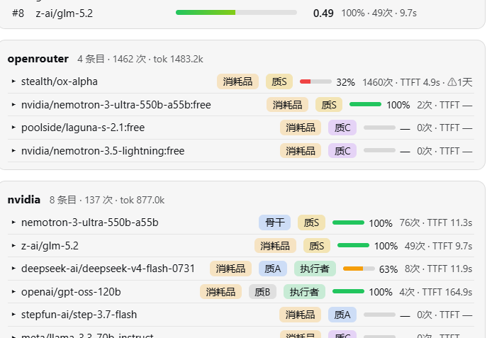

# dsh-poor-router

**A budget-LLM pool router for [DeepSeek Harness](https://www.npmjs.com/package/@deepseek-ai/dsh)** — keep a ledger of every free/cheap model you can reach, watch their health, and reroute around failures automatically, with a web panel and a live reroute badge.

[中文文档](README.zh.md)

## Screenshots

The settings-page dashboard — routing / adaptive / badge toggles, live stat chips, availability ranking (posterior mean × latency penalty), provider-grouped collapsible ledger (expand any row to edit expiry / grant / quality tier inline):



The ⚡ reroute badge at the left of the input box — shows where the most recent request was actually served and why (e.g. `aux-explore` exploration), hover for details, dims after ten minutes:


## The Broke Manifesto

This plugin is built for the broke. **If you can afford API bills, walk away.**

It is well known that the broke have two defining traits: being *poor*, and being a *ghost*.

Poor: we glance at the pricing page and quietly close the tab. A ghost: wherever there is free quota, that is where we haunt. NVIDIA bonus credits, Qwen giveaway grants, GLM flash tiers, OpenRouter `:free` routes… free APIs are everywhere, yet every one of them dies halfway through the burn — you are mid-sentence when it flatlines; you scramble to another, and the next one is barely breathing too. By the end of the night you have spent hours conducting funerals for free APIs.

And so the poor-router makes its grand entrance —

- **It does not give alms; it keeps books.** How much each entry has burned, how many breaths remain, what hour it starts acting up — all on record.
- **It does not pray; it samples.** Who is healthy right now and who is playing dead is decided by Beta posteriors and Thompson sampling. No superstition.
- **It does not accept fate; it reroutes.** When this provider dies mid-stream, its same-tier peer steps in seamlessly — your session never knows anything happened.
- **It does not spend money.** Only when every free model lies dead does the escape hatch release the cheapest capped paid model — and every cent it spends triggers an SMS to inform you of the loss.

The rich have budget alerts, account managers, SLAs.

What do we have? We have **the entire free internet**.

## Why

Free-tier LLM quotas are scattered: NVIDIA's bonus credits, Qwen's giveaway grants, GLM flash tiers, OpenRouter `:free` routes… Each one dies at a different time of day. This plugin treats them as **one pooled resource**: it meters everything you actually send, learns which entries are healthy right now, and quietly swaps the model on failing requests so your run survives instead of dying with the quota.

## Features

- **Automatic ledger** — every request is metered per entry: calls / ok / fail / abort, TTFT EMA, token in/out (incl. reasoning tokens). First-seen models auto-register into `pool.json`.
- **Thompson-sampling adaptive routing** — Beta posterior per entry (success/fail), Gaussian-approximated sampling, TTFT penalty (`3000ms/ttft`), current-hour bucket double-weighted.
- **Hourly buckets v2** — congestion is judged on today's bucket only (`YYYY-MM-DD:HH` local key), with 7-day rolling prune. No more "forefully congested" ghosts from stale data.
- **Same-quality tier ladder** — tag each model `tier: S/A/B/C`; reroutes prefer same tier first, then step down A→B→C, and only climb as a last resort. Tiers are editable from the panel, instantly persisted.
- **Executor pool** — flag cheap high-quota models `role: executor`; trivial/auxiliary subrequests get routed to whichever has the thickest remaining grant. Every 6th such request epsilon-explores an unused free model instead (34% same-tier sampling too).
- **Real-money guardrail** — mark paid models `paid: true` with per-M pricing and a daily cap; they are excluded from all candidate lists and only reachable through the escape hatch when *every* free candidate is dead — cheapest-first, half-cap SMS warning via `text_me`.
- **Provider circuit breaker** — AUTH/QUOTA-class failures cool the provider for 10 min, 429s for 90 s; cooldowns persist across restarts.
- **Forensics** — switch log (ring 50) persisted to disk, TS sample records, persist log, panel-visible everywhere.
- **Web panel** — settings-page dashboard: availability ranking (posterior mean × latency penalty), provider-grouped ledger rows (expandable: edit expiry/grant/tier inline), recent switches, TS picks. Input-box ⚡ badge shows the latest reroute target within ~5 s, toggleable.

## How a routing decision happens

```
llm/stream hook
├─ aux/small request? ──► executor pool (thickest remaining grant)
│                          └─ every 6th ──► epsilon-explore unused free model
├─ provider cooling? ──► pickAlt(): same tier → down A/B/C → escape hatch (paid, capped, cheapest)
├─ model cooling?   ──► pickAlt()
└─ hour-congested?  ──► pickAlt()      (today's bucket fail-rate > 60% @ n≥4)

pickAlt() samples candidates with Thompson sampling × TTFT penalty;
34% chance to inject an unused newcomer into the same-tier window.
Every decision is logged to the ring buffer; nothing writes back to config.
```

## Install

### From GitHub (recommended)

```sh
dsh plugin --profile web add github:yishengdaxiaonengjihui/dsh-poor-router
```

or manually: add `"dsh-poor-router": "github:yishengdaxiaonengjihui/dsh-poor-router"` to the profile's `package.json`, list it under `dsh.profile.bundles`, then `pnpm install`.

### Local link

```sh
# in <DSH_HOME>/profiles/web/
# package.json dependencies:
"dsh-poor-router": "link:D:/somewhere/dsh-poor-router"
```

Then restart DSH. The web client half is packaged by `client-modules` automatically.

## Configuration

Everything lives next to your models in `pool.json`. Plugin-level paths default to `<cwd>/poor-router/`; override in your profile's `cordis.patch.yml`:

```yaml
- id: poor-router
  name: dsh-poor-router
  config:
    dataDir: 'D:/my-data/poor-router'   # base dir for all three files
    # or individually:
    # poolPath: '...'
    # statePath: '...'
    # importPath: '...'
    layerRules:                          # optional default layers by id prefix
      - { match: 'deepseek-official/', layer: 'backbone' }
      - { match: 'tokenrouter/', layer: 'matchstick' }
```

Entry fields that matter:

| field | meaning |
|---|---|
| `id` | `provider/model` — must match what the harness proposes |
| `expiresAt` | ISO date; urgency sort + panel countdown |
| `grantRemaining` / `grantUnit` | executor-pool budgeting |
| `tier` | `S/A/B/C` quality ladder (panel-editable) |
| `role` | `"executor"` joins the aux-request pool |
| `layer` | `backbone` (never burned) / `burn` / `matchstick` |
| `paid` + `priceIn/OutYuanPerM` + `dailyCapYuan` | real-money guardrail |
| `escapeHatch` | allow this paid model as last-resort |

## Agent tools

The plugin registers two session tools:

- `pool_status` — full snapshot (summary + per-entry stats).
- `pool_control` — overrides: `setTier`, `setRouting`, `setAdaptive`, `setBadge`, `setExpiry`, `setGrant`, `setDisabled`, `clearProviderCooldown`, `reloadPool`, …

## FAQ

**Does rerouting change my configured model permanently?**
No. Routing is stateless per request: every request starts from the configured model and may be swapped for that one call only.

**What if all free models die at once?**
The escape hatch kicks in — the cheapest capped paid model serves the request, you get an SMS, and normal service resumes when anything recovers.

**Does it work without the web GUI?**
Yes — tools work headless; the panel/badge simply have nowhere to render.

## License

[MIT](LICENSE)
